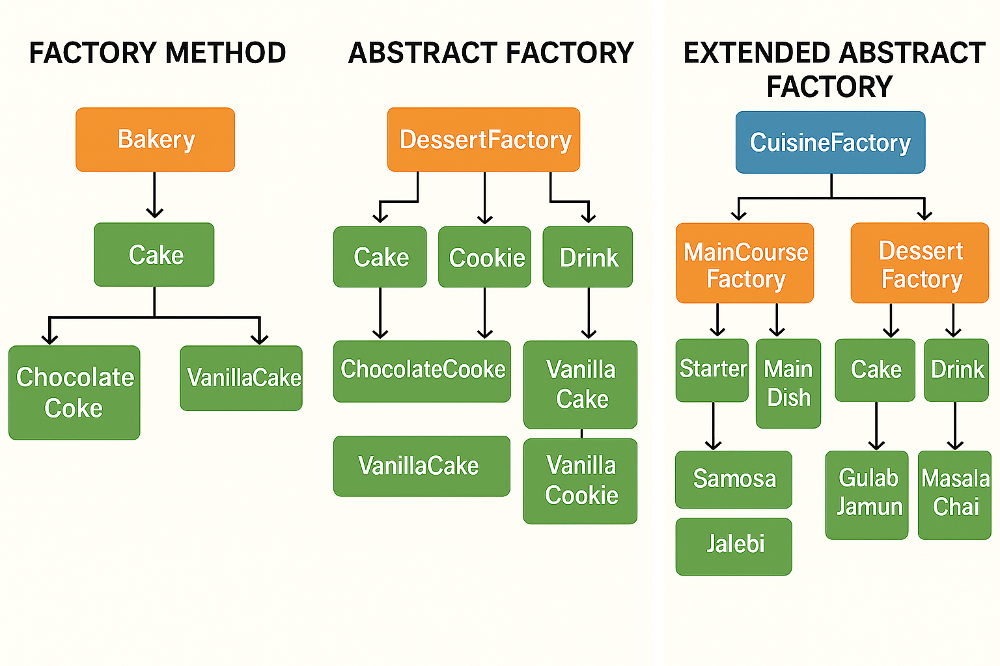

# Factory Method Pattern Vs Abstract Factory Pattern 

---

## 🧠 When to Use Which Pattern?

### ✅ Use **Factory Method** when:
- You need to create **one product**.
- **Subclasses** decide what concrete class to instantiate.

### ✅ Use **Abstract Factory** when:
- You need to create **multiple related products** (like `Button` + `Checkbox`).
- You want to ensure they are used **together consistently** (e.g., both follow Windows or Mac style).

---

## 🧠 Real-World Use Case: GUI Elements

Imagine your app supports two operating systems: **Windows** and **Mac**.

You want to create **Buttons** and **Checkboxes** that behave differently based on the OS.

---

## ✅ 1. Factory Method Pattern

This focuses on creating just **one product** using a factory method — in this case, a `Button`.

---

### 🧱 Code Structure

#### 🔹 Common Product Interface

```python
class Button:
    def render(self):
        pass
```

#### 🔹 Concrete Products  

```python
class WindowsButton(Button):
    def render(self):
        print("Rendering a Windows-style Button.")

class MacButton(Button):
    def render(self):
        print("Rendering a Mac-style Button.")
```

#### 🔹 Creator (GUI Factory)  
```python 
class Dialog:
    def create_button(self) -> Button:
        pass

    def render_window(self):
        button = self.create_button()
        button.render()
```  

#### 🔹 Concrete Factories
```python
class WindowsDialog(Dialog):
    def create_button(self) -> Button:
        return WindowsButton()

class MacDialog(Dialog):
    def create_button(self) -> Button:
        return MacButton()
```

#### 🔹 Client Code
```python
os_type = "Windows"  # or "Mac"
dialog = WindowsDialog() if os_type == "Windows" else MacDialog()
dialog.render_window()
```
---

### ✅ Summary

Here, you're just creating **one type of product** (`Button`) using a **factory method**.

- The client doesn't need to know which specific type of `Button` it's working with.
- New button types can be added **without changing client code**.

---

## 🧩 2. Abstract Factory Pattern

This is used when you want to create **families of related products** — like both `Button` and `Checkbox` — that should work together consistently.

---

### 🧱 Code Structure

#### 🔹 Product Interfaces

```python
class Button:
    def render(self):
        pass

class Checkbox:
    def render(self):
        pass
```

#### 🔹 Concrete Products
```python
class WindowsButton(Button):
    def render(self):
        print("Rendering Windows-style Button.")

class MacButton(Button):
    def render(self):
        print("Rendering Mac-style Button.")

class WindowsCheckbox(Checkbox):
    def render(self):
        print("Rendering Windows-style Checkbox.")

class MacCheckbox(Checkbox):
    def render(self):
        print("Rendering Mac-style Checkbox.")
```

#### 🔹 Abstract Factory
```python
class GUIFactory:
    def create_button(self) -> Button:
        pass

    def create_checkbox(self) -> Checkbox:
        pass
```

#### 🔹 Concrete Factories
```python
class WindowsFactory(GUIFactory):
    def create_button(self) -> Button:
        return WindowsButton()

    def create_checkbox(self) -> Checkbox:
        return WindowsCheckbox()

class MacFactory(GUIFactory):
    def create_button(self) -> Button:
        return MacButton()

    def create_checkbox(self) -> Checkbox:
        return MacCheckbox()
```

#### 🔹 Client Code
```python
def render_ui(factory: GUIFactory):
    button = factory.create_button()
    checkbox = factory.create_checkbox()
    button.render()
    checkbox.render()

# Usage
os_type = "Mac"  # or "Windows"
factory = MacFactory() if os_type == "Mac" else WindowsFactory()
render_ui(factory)
```

---

### ✅ Summary

Here, you're creating a **family of products** (`Button` + `Checkbox`) that are consistent with the same OS look-and-feel.

- This promotes **compatibility** between related UI components.
- New OS-specific components can be added by just implementing a **new concrete factory**.

---

## 🔍 Quick Summary

| Feature     | Factory Method                                  | Abstract Factory                                                      |
|-------------|--------------------------------------------------|------------------------------------------------------------------------|
| **Purpose** | Creates one product                              | Creates families of related products                                  |
| **Design**  | Single product creator (one level of abstraction) | Group of product creators bundled together                            |
| **Extending functionality** | Add new product type by subclassing | Add new product families by subclassing factory |  
| **Client code** | Calls method in concrete subclass | Calls abstract factory methods |
| **Flexibility** | Easy to add new products                    | Easy to add new product families                                      |
| **Example** | Create a `Button`                                | Create a `Windows GUI Factory` that creates both `WindowsButton` and `WindowsCheckbox` |

---

    
# 🧠 What Happens When You Use Factory Method for Multiple Related Products?

Now let's understand what happens if we use the **Factory Method** when we have **more than one related product**.  
We’ll continue with the same GUI example involving `Button`, `Checkbox`, and `TextField` elements.

---

## ✅ Short Answer

You can use the **Factory Method** pattern for 3 products like `Button`, `Checkbox`, and `TextField`,  
but it's **not ideal** if these products are **related** and must be used together as a **family** (e.g., all in Windows or Mac style).  
In that case, **Abstract Factory** is the better pattern.

---

## 🔍 Deeper Explanation

### 🏭 Factory Method

#### Example:
- If you’re building only a `ButtonFactory` to create buttons — that’s fine.
- If you also need a `CheckboxFactory`, `TextFieldFactory`, etc. — each one becomes its **own separate factory**.
- You’d create **3 separate factories**:
  - `ButtonFactory`
  - `CheckboxFactory`
  - `TextFieldFactory`
- ❌ Nothing stops you from mixing incompatible components like `WindowsButton` with `MacCheckbox`, which **breaks UI consistency**.

#### This becomes messy when:
- You want to ensure that **all elements belong to the same UI family**  
  (e.g., all Mac-style or all Windows-style).

---

### 🧰 Abstract Factory

Abstract Factory is ideal when:

- ✅ You have **multiple related products**.
- ✅ You want to ensure that they are used **together correctly**.

#### Example:

- `WindowsFactory` returns:
  - `WindowsButton`
  - `WindowsCheckbox`
  - `WindowsTextField`

- `MacFactory` returns:
  - `MacButton`
  - `MacCheckbox`
  - `MacTextField`

✔ This ensures all widgets used together are from the **same family**.

---

### 🚫 What Goes Wrong If You Use Factory Method?

- You’d create **3 separate factories**:
  - `ButtonFactory`
  - `CheckboxFactory`
  - `TextFieldFactory`

- ❌ Nothing stops you from mixing:
  - `WindowsButton` with `MacCheckbox`
  - Leads to **inconsistent UI**

---

### ✅ When is Factory Method Still Okay?

If `Button`, `Checkbox`, and `TextField` are **not related** (i.e., can be **mixed freely**),  
then **Factory Method is perfectly fine**.

---

## 🔑 Conclusion

| If Products Are...                             | Best Pattern       |
|-----------------------------------------------|--------------------|
| Related + consistent family (e.g., all Windows UI) | Abstract Factory    |
| Independent or only one product is needed      | Factory Method      |

---

---

## Let's understand this via same GUI code example

Here, we’ll write two **separate creators**: one for `Button`, one for `Checkbox`.

---

#### 🔹 Step 1: Common Interfaces

```python
# Common product interfaces
class Button:
    def render(self):
        pass

class Checkbox:
    def render(self):
        pass
```

#### 🔹 Step 2: Concrete Products
```python
# Windows implementations
class WindowsButton(Button):
    def render(self):
        print("Rendering Windows Button")

class WindowsCheckbox(Checkbox):
    def render(self):
        print("Rendering Windows Checkbox")

# Mac implementations
class MacButton(Button):
    def render(self):
        print("Rendering Mac Button")

class MacCheckbox(Checkbox):
    def render(self):
        print("Rendering Mac Checkbox")
```

#### 🔹Step 3: Creator Classes
```python
# Button creator using factory method
class ButtonDialog:
    def create_button(self) -> Button:
        pass

    def render_ui(self):
        button = self.create_button()
        button.render()

# Checkbox creator using factory method
class CheckboxDialog:
    def create_checkbox(self) -> Checkbox:
        pass

    def render_ui(self):
        checkbox = self.create_checkbox()
        checkbox.render()
```

#### 🔹 Step 4: Concrete Creators
```python
# Windows
class WindowsButtonDialog(ButtonDialog):
    def create_button(self) -> Button:
        return WindowsButton()

class WindowsCheckboxDialog(CheckboxDialog):
    def create_checkbox(self) -> Checkbox:
        return WindowsCheckbox()

# Mac
class MacButtonDialog(ButtonDialog):
    def create_button(self) -> Button:
        return MacButton()

class MacCheckboxDialog(CheckboxDialog):
    def create_checkbox(self) -> Checkbox:
        return MacCheckbox()
```

#### 🔹Step 5: Client Code
```python
# Let's say user selects "Mac" as OS
button_dialog = MacButtonDialog()
checkbox_dialog = MacCheckboxDialog()

button_dialog.render_ui()     # Output: Rendering Mac Button
checkbox_dialog.render_ui()   # Output: Rendering Mac Checkbox
```
---

### 🧠 What's the Drawback?

Each UI element needs its **own creator class**, such as:

- `ButtonDialog`
- `CheckboxDialog`
- `TextFieldDialog` *(if you add one)*

And the **client must know** which factory to call for each type.

❌ There’s **no guarantee** the `Button` and `Checkbox` are from the **same platform**,  
which breaks **UI consistency** — this is exactly where the **Abstract Factory** pattern shines.

---
     
           
# Combining Multiple Related Product Families

Now that we understand the difference between **Factory Method** and **Abstract Factory**,  
let’s dive a bit deeper and explore what happens when we have a **combination of related and unrelated objects**.

---

### Guets menu as an Exmaple
You're hosting a dinner for guest. Here’s the breakdown:

### 🧁 Dessert

- If you only need `Cake` → **Factory Method** is enough.
- If you want a **full dessert set** like `Cake + Cookie + Drink` → use **Abstract Factory**.

### 🍛 Main Course

Now, you also want a **Main Course**, which includes:

- `Starter`
- `Main Dish`
- `Side Dish`

You want both **Main Course** and **Dessert** to match a specific cuisine, such as:

- Indian 🇮🇳
- Italian 🇮🇹
- Chinese 🇨🇳

---

## 💡 So What’s the Best Design?

Use **Abstract Factory** for both:

- 🍛 `MainCourseFactory`
- 🧁 `DessertFactory`

Then, introduce a higher-level **`MealFactory`**, which coordinates both main course and dessert factories  
to keep everything within the same **cuisine type**.

---

## 🧱 Structure Overview

```text
+----------------------+
|   AbstractMealFactory|  (Cuisine Level)
+----------------------+
         |
         | uses
         v
+------------------+        +----------------------+
| AbstractDessert  |        | AbstractMainCourse   |
+------------------+        +----------------------+
        |                            |
        v                            v
IndianDessertFactory         IndianMainCourseFactory
ItalianDessertFactory        ItalianMainCourseFactory
```

---

### Example in code

#### 🔹 Step 1: Product Interfaces  
**Main Course**  
```python
class Starter:
    def serve(self):
        pass

class MainDish:
    def serve(self):
        pass
```
**Dessert**  
```python
class Cake:
    def serve(self):
        pass

class Drink:
    def serve(self):
        pass

```

#### 🔹 Step 2: Concrete Products  
**Indian**  
```python
class Samosa(Starter):
    def serve(self):
        print("Serving hot Samosa.")

class Biryani(MainDish):
    def serve(self):
        print("Serving aromatic Biryani.")

class GulabJamun(Cake):
    def serve(self):
        print("Serving sweet Gulab Jamun.")

class MasalaChai(Drink):
    def serve(self):
        print("Serving spicy Masala Chai.")
```
**Italian**  
```python
class Bruschetta(Starter):
    def serve(self):
        print("Serving crispy Bruschetta.")

class Pasta(MainDish):
    def serve(self):
        print("Serving creamy Alfredo Pasta.")

class Tiramisu(Cake):
    def serve(self):
        print("Serving chilled Tiramisu.")

class Espresso(Drink):
    def serve(self):
        print("Serving strong Italian Espresso.")
```

#### 🔹 Step 3: Abstract Factories  
**Dessert Factory**
```python
class DessertFactory:
    def create_cake(self) -> Cake:
        pass
    def create_drink(self) -> Drink:
        pass
```
**Main course Factory**
```python
class MainCourseFactory:
    def create_starter(self) -> Starter:
        pass
    def create_main_dish(self) -> MainDish:
        pass
```

#### 🔹 Step 4: Cuisine Factory (Abstract Factory of Abstract Factories)
```python
class CuisineFactory:
    def get_main_course_factory(self) -> MainCourseFactory:
        pass
    def get_dessert_factory(self) -> DessertFactory:
        pass
```

#### 🔹 Step 5: Concrete Factories  
**Indian Cuisine**
```python
class IndianMainCourseFactory(MainCourseFactory):
    def create_starter(self) -> Starter:
        return Samosa()
    def create_main_dish(self) -> MainDish:
        return Biryani()

class IndianDessertFactory(DessertFactory):
    def create_cake(self) -> Cake:
        return GulabJamun()
    def create_drink(self) -> Drink:
        return MasalaChai()

class IndianCuisineFactory(CuisineFactory):
    def get_main_course_factory(self):
        return IndianMainCourseFactory()
    def get_dessert_factory(self):
        return IndianDessertFactory()
```
**Italian Cuisine**
```python
class ItalianMainCourseFactory(MainCourseFactory):
    def create_starter(self) -> Starter:
        return Bruschetta()
    def create_main_dish(self) -> MainDish:
        return Pasta()

class ItalianDessertFactory(DessertFactory):
    def create_cake(self) -> Cake:
        return Tiramisu()
    def create_drink(self) -> Drink:
        return Espresso()

class ItalianCuisineFactory(CuisineFactory):
    def get_main_course_factory(self):
        return ItalianMainCourseFactory()
    def get_dessert_factory(self):
        return ItalianDessertFactory()
```

#### 🔹 Step 6: Client Code
```python
def serve_meal(cuisine_factory: CuisineFactory):
    main_factory = cuisine_factory.get_main_course_factory()
    dessert_factory = cuisine_factory.get_dessert_factory()

    starter = main_factory.create_starter()
    main_dish = main_factory.create_main_dish()
    cake = dessert_factory.create_cake()
    drink = dessert_factory.create_drink()

    # Serving the full meal
    starter.serve()
    main_dish.serve()
    cake.serve()
    drink.serve()

# Serve Indian Cuisine
print("---- INDIAN CUISINE ----")
serve_meal(IndianCuisineFactory())

print("\n---- ITALIAN CUISINE ----")
serve_meal(ItalianCuisineFactory())
```

#### 🔹 Output
```python
---- INDIAN CUISINE ----
Serving hot Samosa.
Serving aromatic Biryani.
Serving sweet Gulab Jamun.
Serving spicy Masala Chai.

---- ITALIAN CUISINE ----
Serving crispy Bruschetta.
Serving creamy Alfredo Pasta.
Serving chilled Tiramisu.
Serving strong Italian Espresso.
```

---

## 🔚 Summary

✔ This is an **Abstract Factory of Abstract Factories** — each `CuisineFactory` gives you:

- A `MainCourseFactory`
- A `DessertFactory`

Which in turn provide:

- `Starter`, `MainDish` (from Main Course)
- `Cake`, `Drink` (from Dessert)

---



---


