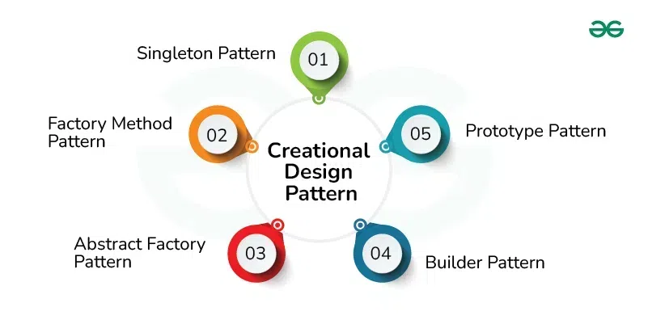

# Design Patterns in Software Development

## 🔹Why do we need Design patterns
Ever worked on a software project that turned into a tangled mess? Maybe adding a simple feature became a nightmare. Or perhaps the code was so confusing that nobody dared to touch it.
These problems often stem from poor design choices. But there's a solution!   
Design patterns are like blueprints for solving common software design problems. They're reusable solutions that can make your code easier to understand, maintain, and scale.
By using design patterns, you can write better code, faster. 

## 🔹What are Design Patterns?
Design patterns are **proven solutions to recurring problems in software design**. Think of them as templates you can adapt to solve specific issues.
A design pattern is a description or template for how to solve a problem that can be used in many different situations.
Unlike algorithms or data structures, design patterns aren't specific pieces of code. They are more like general guidelines for structuring your code. These patterns show how to arrange classes and objects to solve a design problem.

## 🔹History and evolution of design patterns
Design patterns have been around since the 1970s but gained popularity thanks to the Gang of Four (GoF) book, which outlined 23 classic design patterns. These patterns have evolved and expanded over time, shaping the way developers approach software design and development.

## 🔹Benefits of Using Design Patterns
- **Solve complex problems** by breaking them down into smaller, more manageable parts.
- **Improve code readability and reusability**, making it easier for other developers to understand and use your code.
- **Facilitate communication among developers**, as they provide a common language to describe solutions.
- **Improve scalability**, A well-designed application can handle increasing workloads and new features without major rework. For example, using the Observer pattern can allow you to add new features that react to events, with minimal impact to the system. This saves time in the long run.
  
## 🔹Categories of Design Patterns
Design patterns are typically grouped into three main categories. These categories reflect the type of problem they solve:    

#### 🔹 **1. Creational Design Patterns:**  

These patterns deal with **object creation mechanisms**. They help you create objects in a flexible and controlled way.
They help:
- Hide the **creation logic**
- Increase **flexibility** and **reuse**
- Avoid **tight coupling** between classes and the objects they create
  
**Types of Creational Design Patterns**
There are **five main types**:  
  

| Pattern              | Purpose                                                                 | Example Use Case                          | Notes Link                                |
|----------------------|-------------------------------------------------------------------------|--------------------------------------------|--------------------------------------------|
| **1. Singleton**      | Ensures a class has only one instance, and provides global access to it | Database connection, logger                | [View Notes_for_Singleton](CREATIONAL_DESIGN_PATTERNS/1_Singleton_Design_Pattern.md)  |
| **2. Factory Method** | Lets subclasses decide which class to instantiate                       | GUI buttons for different OS               | [View Notes_for_Factory_Method](CREATIONAL_DESIGN_PATTERNS/2_Factory_Method_Design_Pattern.md) |
| **3. Abstract Factory** | Creates families of related objects without specifying concrete classes | UI themes, cross-platform UI kits          | [View Notes_for_Abstract_Factory](CREATIONAL_DESIGN_PATTERNS/3_Abstract_Factory_Design_Pattern.md) |
| **4. Builder**         | Separates complex object construction from its representation           | Building a house or creating an HTML page  | [View Notes_for_Builder](CREATIONAL_DESIGN_PATTERNS/4_Builder_Design_Pattern.md)    |
| **5. Prototype**       | Creates new objects by copying an existing object (clone)               | Copying game characters, settings profiles | [View Notes_for_Prototype](CREATIONAL_DESIGN_PATTERNS/5_Prototype_Design_Pattern.md)  |

---

#### 🔹 **2. Structural Design Patterns**: 

A **structural design pattern** helps you **organize and relate different classes and objects** to form **larger structures**—while keeping them **flexible and efficient**.
They help:
- Simplify **relationships between objects**
- Ensure code is more **modular**, **reusable**, and **easy to change**
- Help create structures **without tightly coupling** components

Think of it like **building a house**:
- You have bricks, beams, and pillars (your classes and objects).
- Structural patterns show you **how to arrange** those pieces so the house is **solid and maintainable**.   

**Types of Structural Design Patterns**
There are **seven main types**:  
    

---

**Structural Design Patterns Summary**

| Pattern           | Description                                | Analogy                            | Notes Link                                                 |
|-------------------|--------------------------------------------|-------------------------------------|------------------------------------------------------------|
| **1. Adapter**    | Connects incompatible interfaces            | Plug adapter                        | [View_notes_for_Adapter_Pattern](STRUCTURAL_DESIGN_PATTERNS/1_Adapter_Pattern.md)         |
| **2. Bridge**     | Separates abstraction from implementation   | Remote control & TV                 | [View_notes_for_Bridge_Pattern](STRUCTURAL_DESIGN_PATTERNS/2_Bridge_Pattern.md)          |
| **3. Composite**  | Treats individual objects and groups uniformly | Folders and files                | [View_notes_for_Composite_Pattern.](STRUCTURAL_DESIGN_PATTERNS/3_Composite_Pattern.md)     |
| **4. Decorator**  | Adds behavior to objects dynamically        | Topping on ice cream                | [View_notes_for_Decorator_Pattern](STRUCTURAL_DESIGN_PATTERNS/4_Decorator_Pattern.md)     |
| **5. Facade**     | Simplifies complex subsystems               | TV remote hiding internal electronics | [View_notes_for_Facade_Pattern](STRUCTURAL_DESIGN_PATTERNS/5_Facade_Pattern.md)          |
| **6. Proxy**      | Acts as a placeholder or controller         | Office receptionist filters visitors | [View_notes_for_Proxy_Pattern](STRUCTURAL_DESIGN_PATTERNS/6_Proxy_Pattern.md)            |
| **7. Flyweigh**t  | Reduces memory by sharing common parts      | Chess pieces on a board             | [View_notes_for_Flyweight_Pattern](STRUCTURAL_DESIGN_PATTERNS/7_Flyweight_Pattern.md)     |

---

#### 🔹**3. Behavioral Design Patterns**: 
Behavioral Design Patterns focus on how **objects communicate and interact** with one another to perform tasks, share responsibilities, and manage flow.   
If:    
Creational = how objects are created    
Structural = how objects are organized    
then   
Behavioral = how objects behave and collaborate  
They help:  
- Define clear responsibility and control flow  
- Simplify complex communication  
- Make systems more flexible and extensible  

**Types of Behavioural Design Patterns**
There are **Ten main types**:  
    

**Behavioral Design Patterns Summary**

| Pattern                  | Description                                                  | Analogy                                           |
|--------------------------|--------------------------------------------------------------|---------------------------------------------------|
| **1. Strategy**              | Selects an algorithm at runtime from a family of strategies  | Choosing a route on Google Maps                   |
| **2. Observer**              | Notifies many objects when one object changes                | YouTube subscribers getting video alerts          |
| **3. Command**               | Encapsulates a request as an object                          | Remote control buttons (undo, redo, play)         |
| **4. State**                 | Changes object behavior based on its state                   | Traffic light switching between red/green         |
| **5. Chain of Responsibility** | Passes request along a chain until someone handles it     | Customer support levels (agent → manager)         |
| **6. Template Method**       | Defines the skeleton of an algorithm, lets subclasses customize | Cooking recipe steps with variations          |
| **7. Iterator**              | Provides a way to access elements without exposing structure | Flipping through pages in a book                  |
| **8. Mediator**              | Centralizes communication between objects                    | Air traffic controller between airplanes          |
| **9. Memento**               | Captures and restores object state                           | Undo feature in a text editor                     |
| **10. Interpreter**          | Implements a language grammar interpreter                    | Calculator interpreting math expressions          |
| **11. Visitor**              | Adds operations to objects without modifying them            | HR doing audits on different employees            |

---

## 🔹Best Practices for Implementing Design Patterns
- **Understand the Problem Before Applying a Pattern** : It’s tempting to see a cool design pattern and want to use it everywhere. But first, take a step back and truly understand the problem you’re trying to solve. Choose a design pattern that fits the specific problem at hand.
- **Keep it Simple** : Design patterns are meant to simplify code and make it more maintainable. If you find yourself adding complexity instead of reducing it, you might be over-engineering. Remember, the goal is to find elegant solutions, not create more problems.
- **Be Open to Refactoring** : As you gain more experience with design patterns, you might realize that a pattern you once thought was perfect for a situation might not be the best fit after all. Be open to refactoring your code and trying out different patterns. Flexibility is key in software development.
  
## 🔹When NOT to Use Design Patterns
Not every problem requires a design pattern. Sometimes, simpler solutions are better. Overusing patterns can lead to over-engineering. This makes the code more complicated than it needs to be. Remember, the goal is to solve the problem. Keep the code simple and easy to understand.  

## 🔹Conclusion
Design patterns offer numerous benefits in software development. They improve code quality. Also, they reduce development time.   
Understanding different types of design patterns is key. Pick the right one for the problem. Do it to make good code.  

